# 小小計帳本 (TinyLedger)

> 🇬🇧 For the English version, please refer to [README.md](README.md)

這是我為自己打造的一款輕量、注重隱私的純本地端記帳工具 (PWA)。
它不僅結合了農民曆與進階理財分析，更棒的是無需安裝任何後端伺服器，只要打開瀏覽器，隨時隨地都能流暢使用！

- **當前版本**：`v1.5.7.1` (2026-09-18)
- **線上體驗 (GitHub Pages)**：[https://ssworld72.github.io/TinyLedger/](https://ssworld72.github.io/TinyLedger/)

---

## 💡 設計理念

這個小工具的誕生，完全是基於我個人的實際記帳經驗與日常使用喜好量身打造的。
與其追求繁雜卻不一定用得到的花俏功能，我更希望能回歸生活本質——我將日常記帳中最常碰到的痛點，以及生活中「如果能這樣記帳就好了」的微小需求，一點一滴轉化為軟體中的實用設計。因此，從介面的流暢度、離線操作的便利性，到農民曆的結合，每一個細節都充滿了「為了解決真實生活情境」的務實考量。希望這份從我個人體驗出發的軟體，也能剛好契合其他人的日常所需，成為一款順手的理財夥伴。

---

## 💬 交流與討論

如果在使用過程中有任何想法、建議，或是遇到了問題，非常歡迎透過以下方式與我交流：
- **[問題回報 (Issues)](https://github.com/SSWorld72/TinyLedger/issues)**：如果發現了 Bug 或有新功能想許願，可以在這裡提出。
- **[專屬討論區 (Discussions)](https://github.com/SSWorld72/TinyLedger/discussions)**：如果有記帳上的心得想分享，或是任何不限主題的閒聊與提問，都歡迎來討論區坐坐！

---

## ☕ 支持與贊助

這是一個完全**免費、開源、無廣告**的個人小專案。

從敲下第一行程式碼開始，每一個功能、每一次抓蟲、每一個熬夜更新的版本，都是因為對「讓記帳變簡單」這件事的熱情。沒有團隊也沒有金主，只有我一個人配上一台電腦，默默把它打磨成現在的樣子。

如果這個小工具剛好有幫上忙，理清了生活中的收支，或者讓記帳這件小事變得稍微輕鬆了一點，那它就已經達成最初的心願了。

如果願意更進一步請我喝杯咖啡 ☕ —— 那絕對是支持我繼續維護下去的最大動力！每一份贊助無論大小，對我來說都是超級溫暖的鼓勵，代表真的有人在使用、也覺得它有價值。

**謝謝，真的。** 🙏

[](https://ko-fi.com/A0R125NYMU)

---

## ✨ 主要功能

這套系統涵蓋了我日常生活中會用到的各種情境：

### 📝 記帳與收支管理
- **一般紀錄清單**：支援收入、支出的日常記帳，可以自己定義大類別、小類別，還能標記這筆錢是花在誰身上（例如：自己、家人、特定專案），支援單筆即時檢視與刪除。
  
  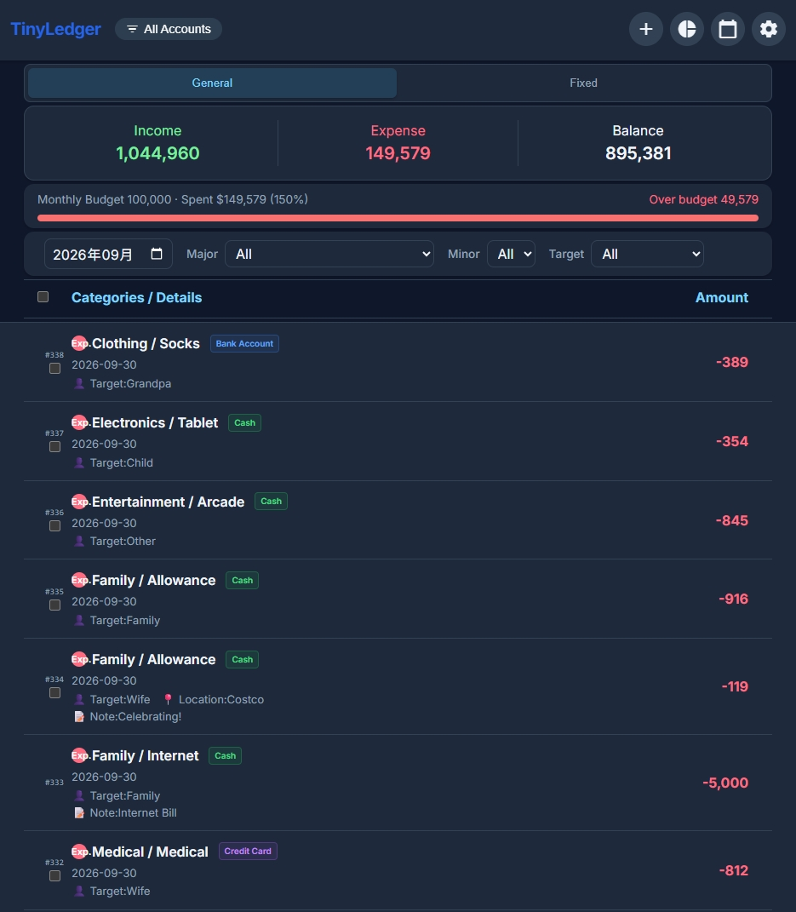

- **新增與編輯紀錄**：直覺好操作的記帳視窗，快速輸入金額、選擇分類、設定交易對象，並提供備忘備註與即時計算。
  
  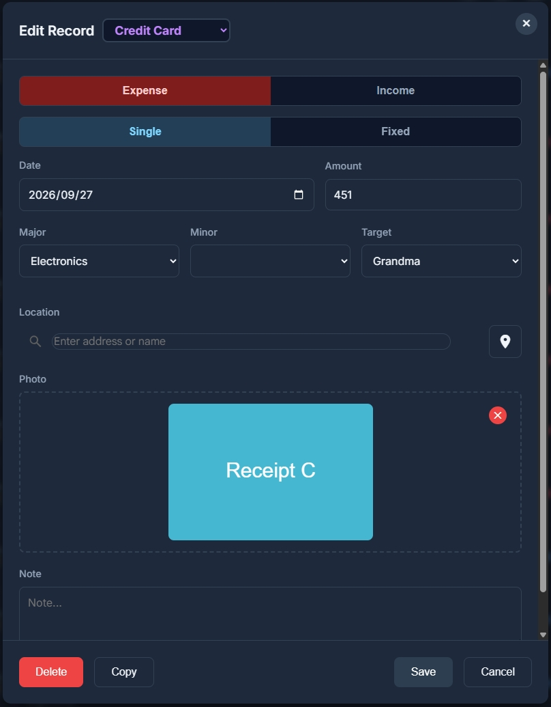

- **實體收據照片上傳**：有時候拿到了實體發票或收據，我會想拍下來存著。系統支援直接拍照或上傳照片，內建了裁切與壓縮工具，不怕照片佔空間，而且隨時可以重新裁切。
  
  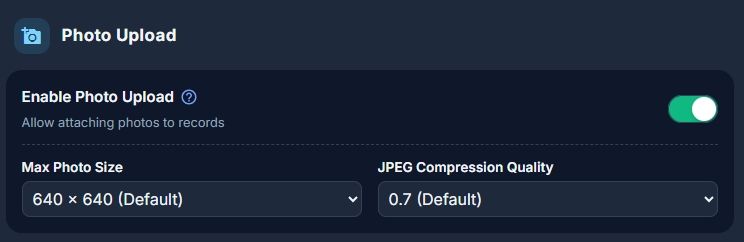

- **固定紀錄清單**：針對每個月的房租、每週固定支出或是每年的訂閱費，自動彙整所有固定收支規則，清楚列出下次執行時間與循環頻率。
  
  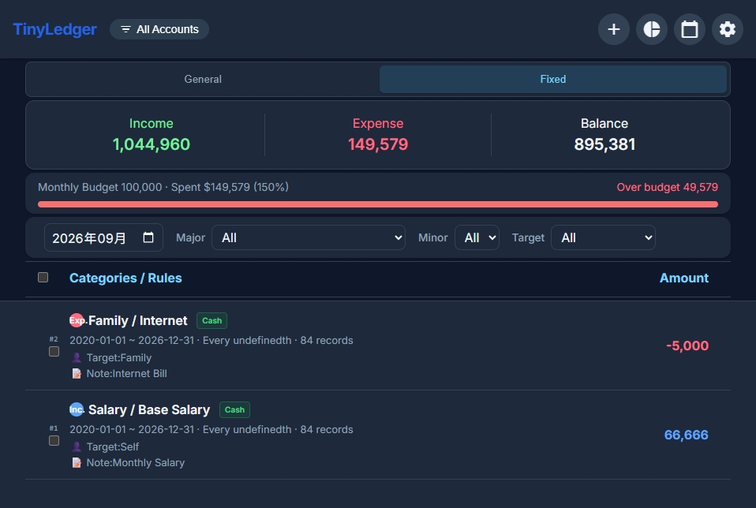

- **固定規則設定與編輯**：只要設定好週期（每日、每週、每月、每年等），系統就會自動幫我產生未來的預期紀錄，省去重複記帳的麻煩。
  
  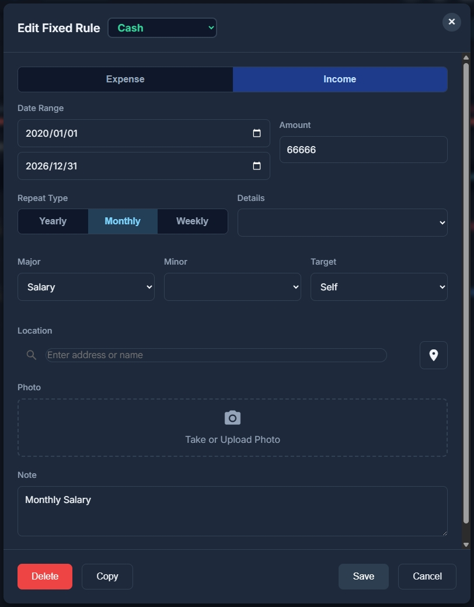

- **交易資訊與對象管理**：可隨時管理自訂的收支對象（例如：家人、特定朋友、專案等）與自訂大/小分類，讓每筆收支歸屬更加精準明確。
  
  

- **多帳戶管理與獨立預算**：支援自訂多個資產帳戶（如現金、銀行帳戶、信用卡等），並可為各帳戶指派獨立預算與預設使用帳戶，帳目分流更清晰。
  
  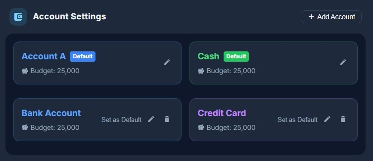

- **預算控管**：我可以設定「本月總預算」與「個別帳戶預算」，系統會根據累積的支出動態顯示進度條，隨時提醒自己別超支了。

  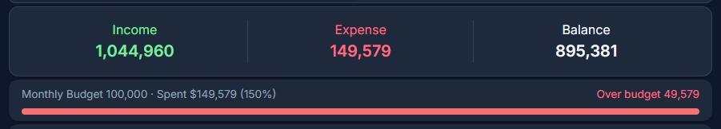

- **清單分頁與顯示筆數**：可自設「每頁 N 筆」（10 / 20 / 30 / 40 / 50 / 100 / 全部），切換月份或篩選條件時自動回第一頁。設定會持久儲存，備份/還原後也保留。

### 📅 萬年曆與農民曆整合
- **日曆檢視與顯示設定**：內建美觀的月曆模式，每天的收支總計一目了然；可依個人偏好自訂一週起始日（週日或週一）、農曆節氣顯示及國定假日標記。
  
  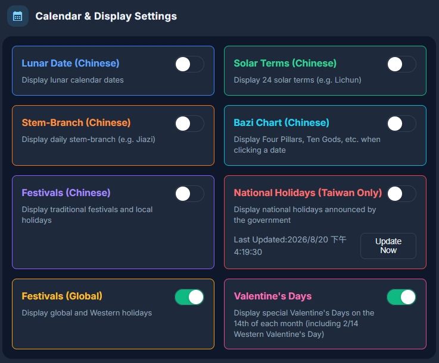

- **當日交易紀錄與重要節慶提醒**：點選日曆上的任一天，即可即時展開該日的收支清單明細，並同時顯示當日的傳統民俗節慶提醒。
  
  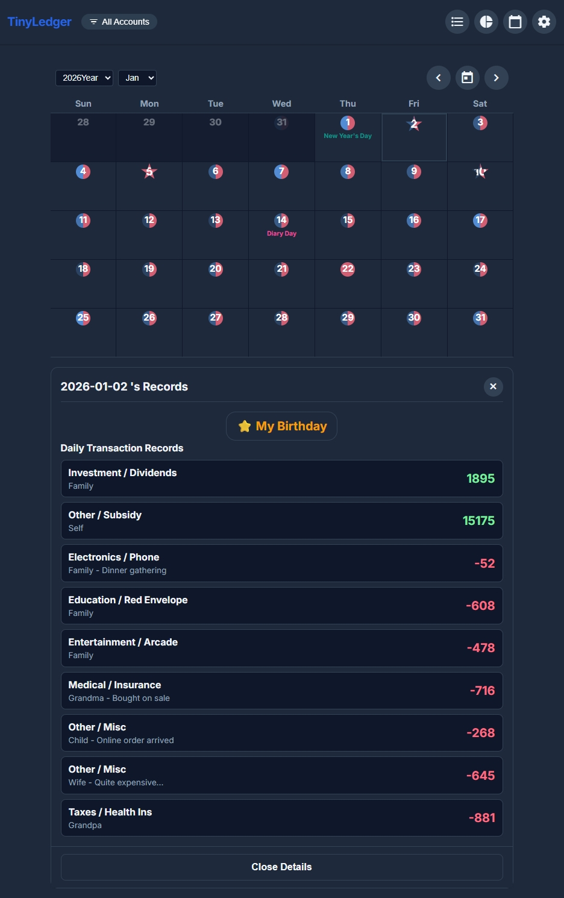

- **重要節慶提醒**：整合台灣二十四節氣與傳統重大節日（如春節、端午、中秋等），在日曆上即時標註，貼心提醒生活中的重要時刻。
  
  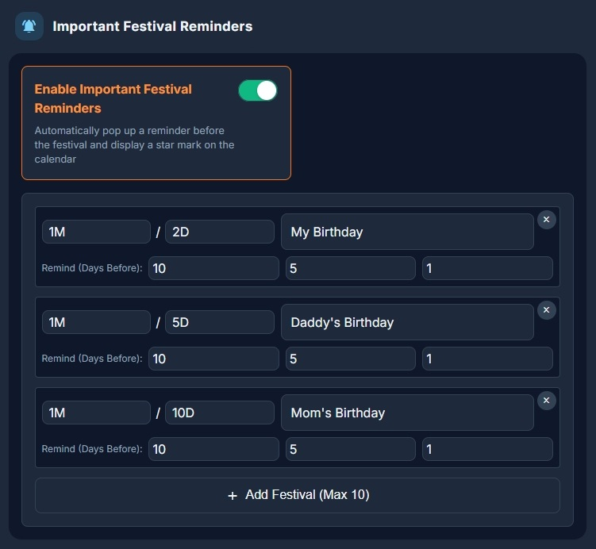

- **傳統農民曆**：身在台灣，看日子還是很重要的！我整合了農曆日期、天干地支（八字排盤）、二十四節氣與傳統節慶。

  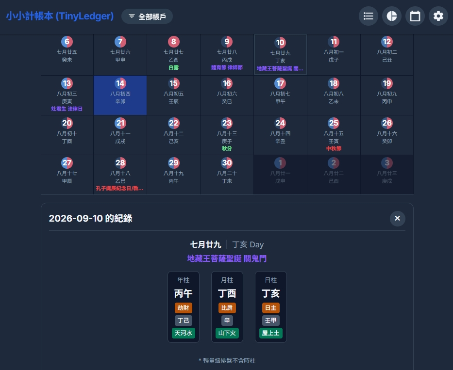

- **國定假日**：系統會自動串接台灣人事行政總處的資料，顯示台灣專屬的國定假日與休市日，按個鈕就能更新。（註：未來若有其他國家提供可串接的公開 API，也可以評估串接並新增支援！）
  > 📌 **資料來源致謝**：感謝開源專案 [ruyut/TaiwanCalendar](https://github.com/ruyut/TaiwanCalendar) 將台灣政府行事曆資料整理為易於使用的 JSON 格式提供串接。
  
  .jpg)

- **地點定位與 Google 地圖**：串接了 Google Maps，出門記帳時可以一鍵定位並記錄消費地點，還能直接點擊連結開啟地圖導航，回憶起來更有感覺。
  
  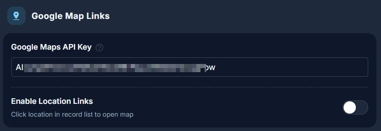

### 📊 統計與圖表分析
- **圓餅圖（類別佔比分析）**：以原生 SVG 甜甜圈圖呈現各類別支出或收入佔比，支援互動點選下鑽查看子分類，快速掌握資金流向。
  
  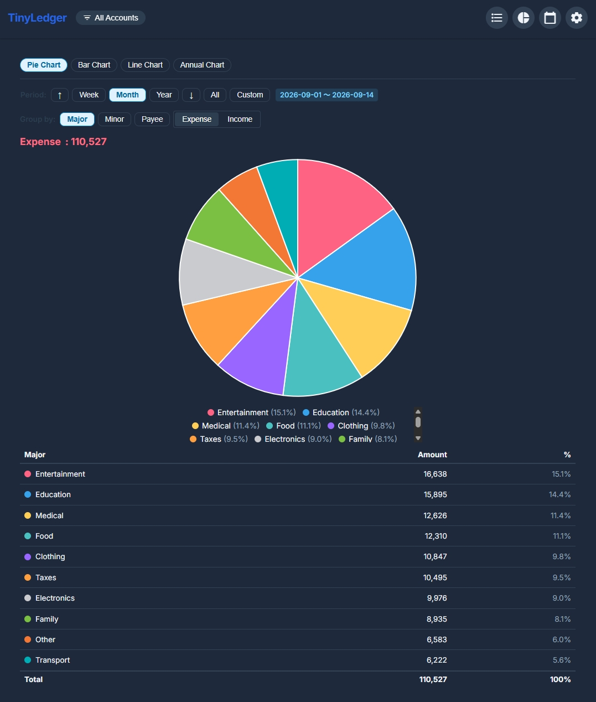

- **長條圖（收支趨勢對比）**：直觀的柱狀走勢圖，清晰對比每月份或每日的支出與收入變化，一眼看出開銷高峰。
  
  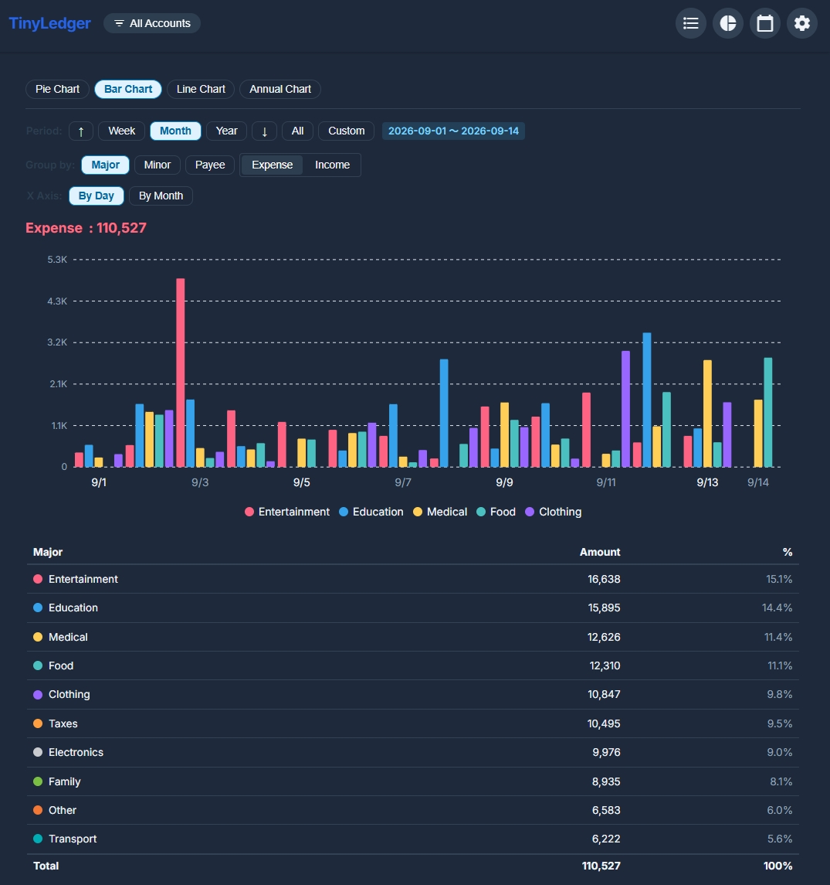

- **折線圖（收支走勢分析）**：連續平滑的折線走勢，幫助觀察資金隨時間波動的情形，輔助擬定長遠儲蓄計畫。
  
  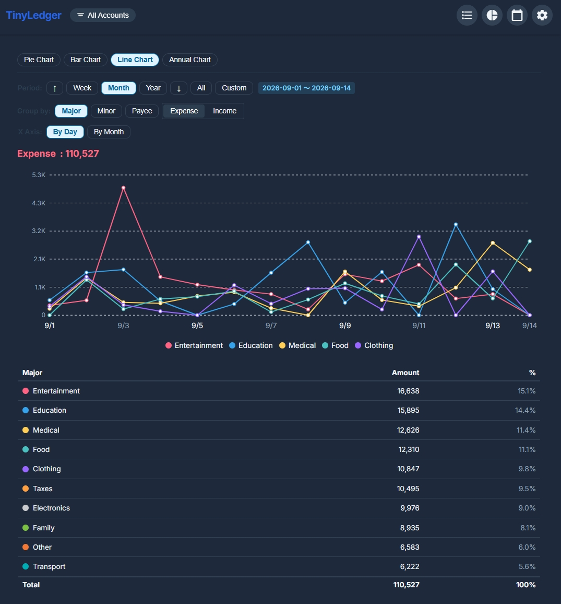

- **年度收支統計分析**：跨月份與整年度的全方位收支報表，整合各項指標總結，年度結算省時省力。
  
  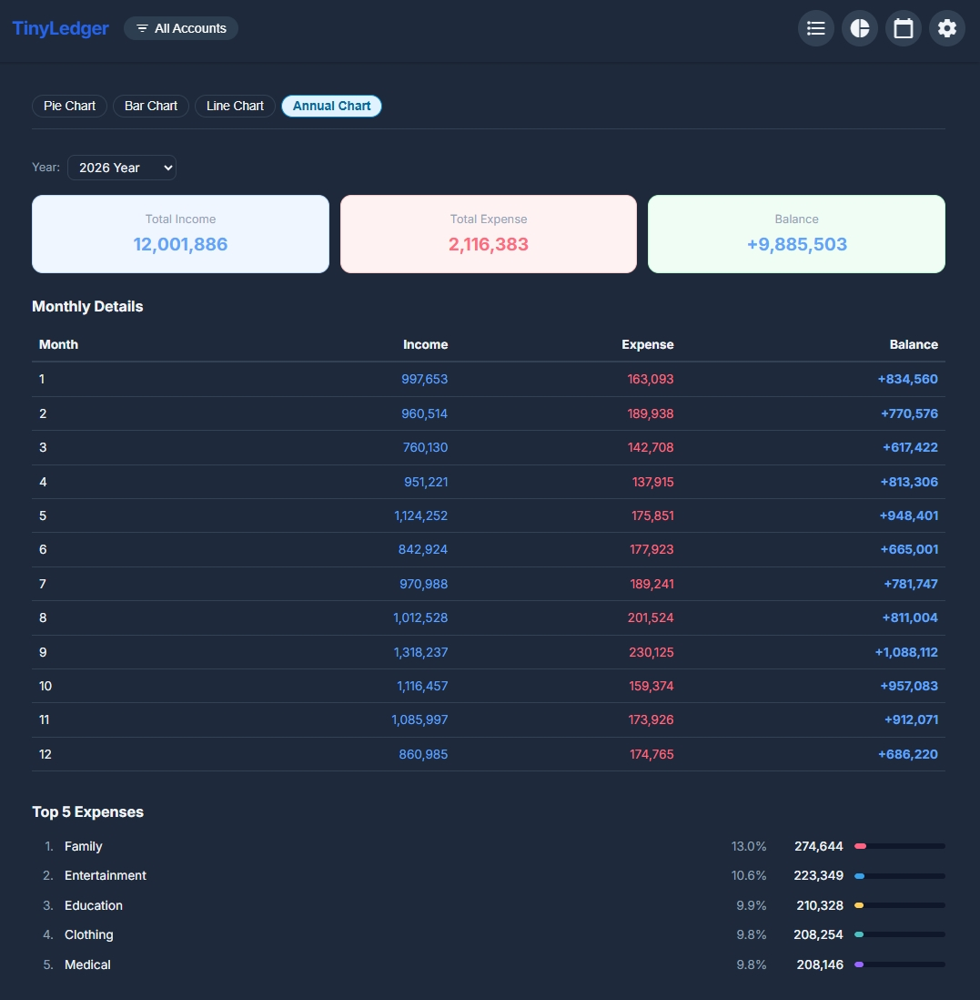

- **多維度篩選**：可以依照時間、收支類型、類別或是特定對象進行深度篩選，算帳時特別好用。

  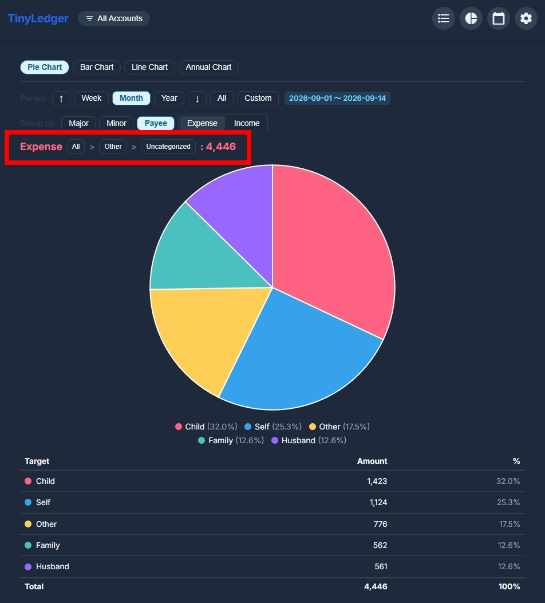

### ☁️ 備份與還原
- **手動與定時自動備份**：支援手動立即備份與瀏覽器定期背景自動備份機制，資料安全多一層保障。

- **GAS 私有雲端備份**：我實在不想把個人的財務隱私放在別人的伺服器上，所以寫了 Google Apps Script (GAS)，讓資料加密備份到我專屬的 Google 雲端硬碟。

- **ZIP 圖文分離技術**：無論是雲端同步還是地端下載，系統皆採用 ZIP 圖文分離壓縮，將文字與照片分開打包，確保備份檔體積最小化，方便跨設備轉移。

  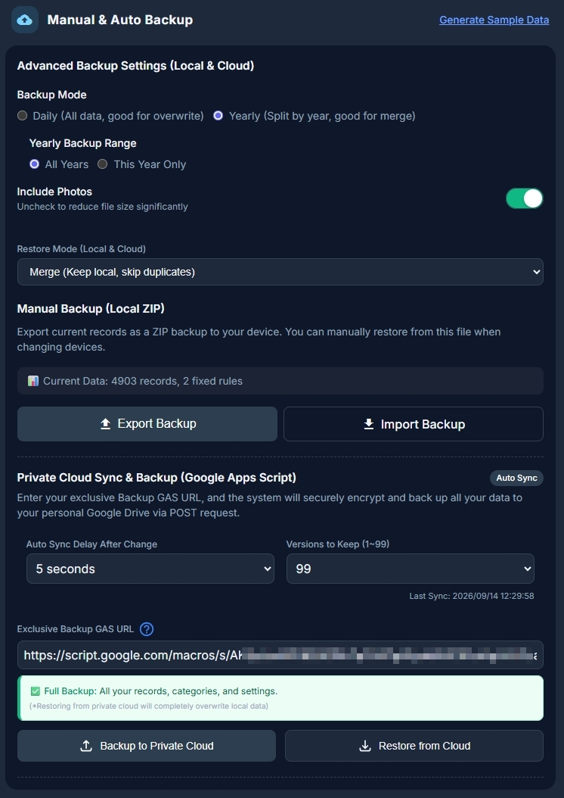

- **精準的同步狀態與進度**：支援精確至個位數的四行並列資料寫入進度表，在還原大量資料時不再卡頓，能夠順暢、真實地反映每一筆還原狀況。

- **資料庫安全與危險區域**：提供嚴謹的危險區域防呆設計，包含一鍵清除舊快取、重設特定資料庫或全系統清空復原，確保操作安全透明。
  
  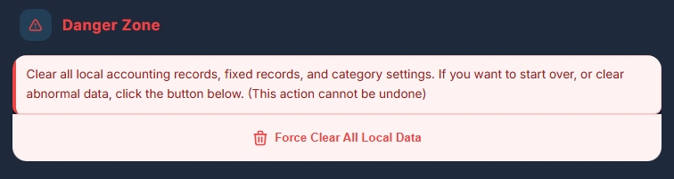

- **純離線架構**：所有資料都存在瀏覽器的 IndexedDB 裡，就算在沒有網路的地下室也能正常記帳。

### 🎨 介面與體驗
- **外觀主題與色彩自訂**：提供高雅深色、現代淺色等多款主題配色，更支援色彩自訂微調，打造獨一無二的專屬視覺。
  
  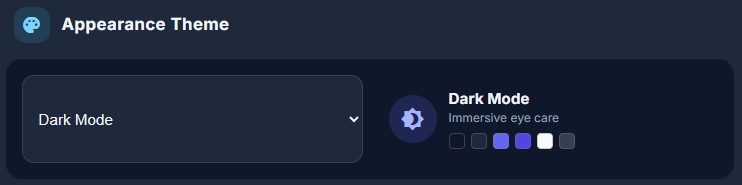

- **多國語言切換 (i18n)**：內建完善的繁體中文、簡體中文、英文、日文、韓文、泰文、印度文、法文與德文等 9 種語系切換，所有功能、欄位與提示訊息皆可即時雙向無縫切換。
  
  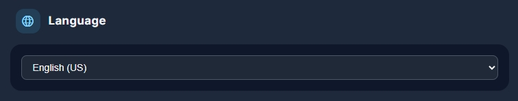

- **PWA 支援**：可以直接把網站加到手機桌面，用起來就像原生的 App 一樣順暢。

- **觸控與手勢優化**：我針對手機跟平板的操作體驗做了很多調整，滑動、點擊都很直覺。

- **個人化顯示設定**：每頁顯示筆數等個人喜好設定，持久儲存於裝置本地，備份/還原時一併保留。

### ⚙️ 系統設定與資訊
- **系統運作日誌 (System Logs)**：詳細記錄備份、還原、資料庫升級與各項關鍵操作歷程，發生異常時可隨時調閱排查，透明可靠。
  
  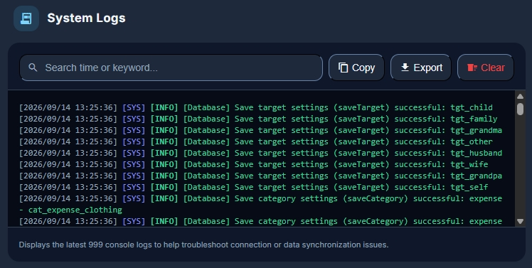

- **關於系統與版本資訊**：清楚展示專案版本號、致謝名單、開源套件授權與作者資訊，持續迭代更新保持最佳品質。
  
  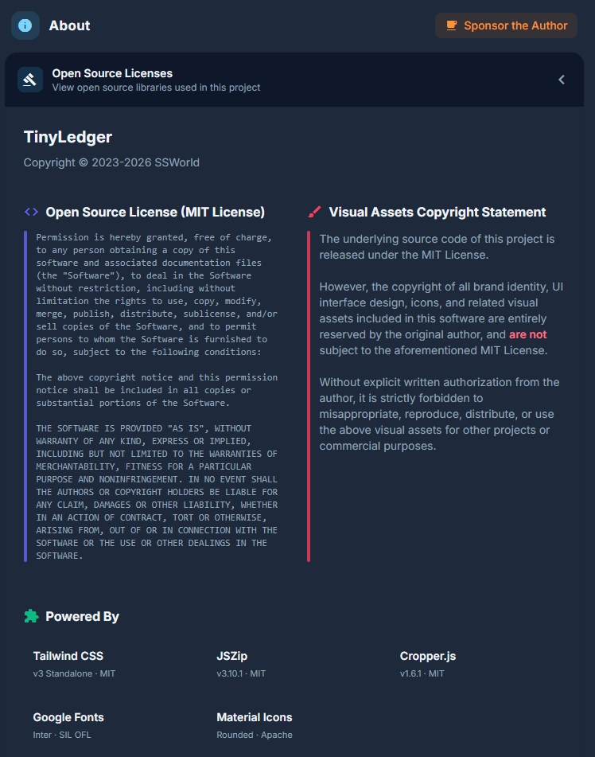

---

## 🏗️ 技術架構

| 項目 | 說明 |
|---|---|
| 前端框架 | Vanilla JavaScript (ES Module) + Tailwind CSS |
| 本地儲存 | IndexedDB + LocalStorage |
| 圖表引擎 | 純原生 SVG 引擎 (自研 `charts.js`) |
| 日曆運算 | 傳統農民曆與干支演算法 |
| 跨域與定位 | Google Apps Script (GAS) / Google Maps Places API |
| 部署方式 | GitHub Pages (靜態網頁) 或本地瀏覽器直接開啟 |

---

## 🚀 快速開始

不需要安裝任何軟體，直接點開網址就能用！
👉 [https://ssworld72.github.io/TinyLedger/](https://ssworld72.github.io/TinyLedger/)

### 🎲 測試資料產生器 (Generate Sample Data)
如果你想快速體驗系統功能，可以使用內建的測試資料產生器。它會自動為你填入過去幾個月的隨機收支與圖表資料，方便你預覽：
👉 [https://github.com/SSWorld72/TinyLedger/generate_sample.html](https://github.com/SSWorld72/TinyLedger/generate_sample.html)

> **⚠️ 重要使用建議**
> 
> 因為這是一個純前端的工具，所有的資料都存在瀏覽器裡面。**如果手動清除了瀏覽器的「網站資料與快取 (Cache)」，記帳紀錄就會不見！**
> 
> 👉 強烈建議在使用前，先到「系統設定」完成 **「私有雲端備份 (GAS Backend)」** 的綁定。綁定後，只要輕點一下就能把資料備份到專屬的 Google 雲端硬碟，再也不怕資料遺失！

---

## ☁️ 設定私有雲端備份 (GAS Backend)

這是我為了解決隱私問題而設計的方案，支援將記帳資料加密備份到私人的 Google 雲端硬碟，達到 100% 的隱私與跨裝置同步。

### 部署教學 (只需設定一次)

#### 第一階段：貼上程式碼
1. 前往 [Google Apps Script](https://script.google.com/)，點選左上角的「＋ 新專案」。
2. 點選左上方預設的「未命名的專案」，將它改名為容易辨識的名稱，例如：`通用_私有雲端備份`。
3. 將本系統 `utils/gas/` 目錄下提供的 `gas_private_backup.js` 程式碼全部貼上並儲存。

#### 第二階段：部署並設定權限
1. 點擊畫面右上角的藍色按鈕「部署」，選擇「新增部署作業」。
2. 在跳出的視窗中，點擊左上角齒輪圖示，勾選「網頁應用程式」。
3. **【最重要】**：「執行身分」請務必選擇「**我**」，「誰可以存取」請選擇「**所有人**」。
4. 設定好後，按下右下角的「部署」。

#### 第三階段：授權與取得網址
1. (首次部署) 系統會跳出授權視窗，點擊「授權存取」並選擇 Google 帳號即可。
2. (首次部署) 若出現警告畫面，請點擊左下角「進階」->「前往 (不安全)」，然後點擊「允許」。
3. 授權完成後，複製「網頁應用程式」下方的「**網址 (URL)**」。
4. 回到計帳本的「系統設定」頁面，將網址貼入 GAS 雲端備份的格子中，即可完成綁定！

> 💡 **小撇步**：如果之前已經為其他專案部署過通用版的 GAS 備份腳本，可以直接貼上同一個網址！系統會自動在雲端硬碟中依照專案名稱分門別類儲存，完全不會互相覆蓋。

---

## 📦 第三方開源套件 (Third-Party Libraries)

為確保專案的「純淨」與 100% 離線運作能力 (PWA)，我將所有外部套件統一放置於 `libs/` 目錄中，不與專案自有的程式碼混用。這部分維持嚴謹的管理規範：

- **Cropper.js** (`libs/cropper/`): 用於提供進階的照片裁切與手勢縮放功能。
  > 關於套件的更新與引用方式，請參考 [libs/cropper/README.md](libs/cropper/README.md) 的詳細說明。
- **JSZip** (`libs/jszip/`): 提供瀏覽器端 ZIP 打包與解壓縮功能，用於地端圖文分離備份。
  > 關於版本資訊與來源，請參考 [libs/jszip/README.md](libs/jszip/README.md) 的詳細說明。
- **Tailwind CSS** (`libs/tailwind/`): 用於提供工具型 CSS class 輔助排版。
  > 關於離線引入的原因與使用方式，請參考 [libs/tailwind/README.md](libs/tailwind/README.md) 的詳細說明。
- **Google Fonts - Inter** (`libs/fonts/`): 用於整體介面文字排版的無襯線字體，提升閱讀體驗。
  > 為了確保極端離線狀態的穩定性，字型檔 (`.woff2`) 已經打包下載於本地端，不再依賴外部 CDN。採用 SIL OFL 1.1 授權。
- **Material Icons** (`libs/icons/`): 提供介面中使用的各種實用圖示（如設定、編輯、刪除等）。
  > 為了確保斷網時圖示不破圖，核心字型檔 (`.woff2`) 已完全本地化。採用 Apache License 2.0 授權。

---

## 🗺️ 設定 Google Maps API (選填)

如果跟我一樣喜歡在記帳時順便記錄消費地點，也可以考慮串接 Google Maps Places API。

### 申請與綁定教學 (只需設定一次)

#### 第一階段：建立 Google Cloud 專案
1. 前往 [Google Cloud Console](https://console.cloud.google.com/)，使用 Google 帳號登入。
2. 點擊頂部導覽列的「**選取專案**」下拉選單，再點擊右上角的「**新增專案**」。
3. 輸入一個容易辨識的專案名稱（例如：`TinyLedger Map`），然後按「建立」。
4. 建立完成後，確認目前已選擇到該專案（頂部應顯示剛建立的專案名稱）。

#### 第二階段：啟用 API 並建立金鑰
1. 在左側選單中點擊「**API 和服務**」>「**程式庫**」。
2. 在搜尋框中搜尋並啟用以下兩個 API：
   - **Places API (New)**
   - **Maps JavaScript API**
3. 回到左側選單，點擊「**API 和服務**」>「**憑證**」。
4. 點擊頂部的「**+ 建立憑證**」>「**API 金鑰**」，系統會自動產生一組金鑰。
5. 在彈出的視窗中，先**複製**這組金鑰（待會要貼回 APP）。

#### 第三階段：（建議）限制金鑰 + 貼回設定
1. 在剛才的彈出視窗中，點擊「**編輯 API 金鑰**」（或在憑證列表中點該金鑰的鉛筆圖示）。
2. 在「**應用程式限制**」區塊選擇「**網站**」，並點擊「**+ Add**」加入 `https://ssworld72.github.io/*` 以允許正式上線版存取。*(註：若有在本地端開發的需求，可再額外加入 `http://127.0.0.1/*` 與 `http://localhost/*`)*
3. 向下捲動到「**API 限制**」區塊，選擇「**限制金鑰**」，然後下拉勾選剛才啟用的上述兩個 API 進行綁定。
4. 按下「**儲存**」即可。
5. 最後，將複製好的金鑰貼回設定頁面的「**Google Maps API Key**」輸入框中，大功告成！

> 💡 **費用說明**：Google 每月提供 200 美元的免費地圖額度，對於一般個人記帳用途來說，完全不需擔心費用問題。填寫帳單資訊僅為 Google 的防濫用認證步驟。

---

## 🌐 多語系 (i18n) 擴充指南

本專案支援國際化多語系，若想要新增一組新語言（例如：日文 `ja-JP`），只需三個步驟：

1. **建立專案專屬字典檔**：
   - 複製 `i18n/zh-TW.js`，另存為 `i18n/ja-JP.js`。
   - 將裡面的中文翻譯替換為對應的日文。
2. **建立共用模組字典檔**：
   - 複製 `utils/i18n/zh-TW.js`，另存為 `utils/i18n/ja-JP.js`。
   - 翻譯共用元件（如圖表格式、備份提示等）的文字。
3. **註冊新語系 (主專案層級)**：
   - 打開 `i18n/manifest.js`。
   - 在 `supportedLanguages` 陣列中新增一筆紀錄，例如：`{ code: 'ja-JP', nativeName: '日本語' }`。
4. **註冊新語系 (共用底層防呆備用)**：
   - 打開 `utils/js/i18nEngine.js`。
   - 找到 `const supportedLanguages = manifestMod.supportedLanguages || [` 這段程式碼，將新語系同步加進備用陣列中。這能確保當主專案的語言清單因快取或網路問題載入失敗時，系統仍能安全降級並正確顯示新語言。

完成上述步驟後，重新整理網頁，即可在系統「設定」的語言選單中看到新語系，切換後系統便會自動套用該字典檔。

---

## 📁 檔案清單與用途說明

以下為專案的技術檔案架構與模組化說明。本專案採用純前端架構 (HTML/CSS/JS)，所有的檔案設計皆遵循高內聚、低耦合的原則：

```text
📦 TinyLedger (小小計帳本)
 ├── 🧩 components/ .............................. UI 視圖碎片，透過 htmlLoader 動態載入
 │    ├── 🗂️ modals/ ........................... 對話框
 │    │    ├── 📄 modal-account-filter.html ...... 帳戶篩選器的下拉對話框
 │    │    ├── 📄 modal-add-record.html .......... 新增或編輯單筆記帳紀錄的表單視窗
 │    │    ├── 📄 modal-crop.html ................ 上傳收據照片時的圖片裁切與縮放視窗
 │    │    ├── 📄 modal-photo-settings-help.html . 設定頁中照片備份機制的說明與教學視窗
 │    │    ├── 📄 modal-settings-manage-cat.html . 用來新增、刪除、重新排序特定收支類別的編輯視窗
 │    │    └── 📄 modal-settings-manage-target.html . 用來新增與編輯特定對象的視窗
 │    └── 🗂️ tabs/ ............................. 主頁面分頁
 │         ├── 📄 tab-calendar.html .............. 月曆視圖與每日收支清單分頁
 │         ├── 📄 tab-settings.html .............. 系統設定、資料備份與帳戶管理分頁
 │         └── 📄 tab-stats.html ................. 統計報表與圖表分頁
 │
 ├── 🎨 css/ ..................................... 專屬樣式
 │    ├── 📄 calendar.css ........................ 專門負責月曆檢視的排版，包含農曆日期、節日與收支圓點標記的樣式
 │    ├── 📄 modal.css ........................... 統一定義所有對話視窗 (Modal) 與全域遮罩層的彈出與關閉動畫樣式
 │    └── 📄 style.css ........................... 專案主要的樣式檔，負責定義專屬的版面、動態效果與佈景變數
 │
 ├── 🌐 i18n/ .................................... 專案多語系字典 (雙層架構中的應用層)
 │    ├── 📄 manifest.js ......................... 語系宣告清單，定義系統支援的語言代碼與名稱
 │    ├── 📄 zh-TW.js ............................ 專案專屬的繁體中文語系基準檔
 │    ├── 📄 zh-CN.js ............................ 專案專屬的簡體中文語系檔
 │    ├── 📄 en-US.js ............................ 專案專屬的英文語系檔
 │    ├── 📄 ja-JP.js ............................ 專案專屬的日文語系檔
 │    ├── 📄 ko-KR.js ............................ 專案專屬的韓文語系檔
 │    ├── 📄 th-TH.js ............................ 專案專屬的泰文語系檔
 │    ├── 📄 hi-IN.js ............................ 專案專屬的印度文語系檔
 │    ├── 📄 fr-FR.js ............................ 專案專屬的法文語系檔
 │    └── 📄 de-DE.js ............................ 專案專屬的德文語系檔
 │
 ├── ⚙️ js/ ...................................... 專案核心邏輯
 │    ├── 🗂️ components/ ......................... 視圖控制器
 │    │    ├── 📄 calendarView.js ................ 月曆視圖邏輯，負責處理日曆渲染、每日明細展開與每月收支統計
 │    │    ├── 📄 locationSearch.js .............. 地點搜尋邏輯，處理表單中的地點搜尋、自動完成與最近地點選取
 │    │    ├── 📄 recordModal.js ................. 新增/編輯紀錄的對話視窗邏輯，包含相機拍照、Cropper 裁切與照片壓縮處理
 │    │    ├── 📄 settingsView.js ................ 系統設定頁面邏輯，包含全域選項儲存與讀取，以及地端備份/還原邏輯
 │    │    └── 📄 statsView.js ................... 統計頁面邏輯，負責處理篩選、計算各類別加總，以及繪製圖表
 │    ├── 🗂️ utils/
 │    │    └── 📄 htmlLoader.js .................. HTML 動態載入器，負責在執行期載入 components/ 下的各個模組化視圖與對話框
 │    ├── 📄 app.js .............................. 應用程式主邏輯，負責初始化、事件綁定與清單渲染，並協調各個元件
 │    ├── 📄 db.js ............................... 資料庫層，封裝對瀏覽器 IndexedDB 的所有原生操作 (CRUD)
 │    ├── 📄 i18nMigration.js .................... 負責多語系系統導入後的資料庫遷移與舊資料相容（舊有寫死中文類別轉譯）
 │    ├── 📄 state.js ............................ 狀態管理中樞，集中管理全域變數 (Global State) 並處理過濾器與統計計算
 │    └── 📄 utils.js ............................ 專案專屬的基礎工具函式 (負責固定收支展開計算、交易特徵碼產生等)
 │
 ├── 📦 libs/ .................................... 第三方套件
 │    ├── 🗂️ cropper/ .......................... 提供照片拖拉縮放與裁切功能
 │    ├── 🗂️ fonts/ ............................ Google Fonts (Inter) 的本地化字型檔
 │    ├── 🗂️ icons/ ............................ Material Icons 的本地化字型檔
 │    ├── 🗂️ jszip/ ............................ 提供瀏覽器端 ZIP 打包與解壓縮功能
 │    └── 🗂️ tailwind/ ......................... 提供工具型 CSS class 輔助排版
 │
 ├── 🖼️ pics/ .................................... README 說明文件使用的系統操作截圖
 │
 ├── 🛠️ utils/ ................................... 跨專案共用底層模組
 │    ├── 🎨 css/
 │    │    └── 📄 modern-ui.css .................. 全專案共用的現代化 UI 樣式系統與基礎顏色變數
 │    ├── ☁️ gas/ ................................ Google Apps Script 後端部署
 │    │    ├── 📄 gas_private_backup.js .......... 部署於 Google Apps Script 端的私有雲備份後端腳本（通用版）
 │    │    └── 📄 gas_proxy_with_logging.js ...... 具備擴充日誌機制的雲端備份後端腳本
 │    ├── 🌐 i18n/ ............................... 共用模組多語系字典 (雙層架構中的共用層)
 │    │    ├── 📄 zh-TW.js ....................... 底層共用模組的繁體中文語系基準檔
 │    │    ├── 📄 zh-CN.js ....................... 底層共用模組的簡體中文語系檔
 │    │    ├── 📄 en-US.js ....................... 底層共用模組的英文語系檔
 │    │    ├── 📄 ja-JP.js ....................... 底層共用模組的日文語系檔
 │    │    ├── 📄 ko-KR.js ....................... 底層共用模組的韓文語系檔
 │    │    ├── 📄 th-TH.js ....................... 底層共用模組的泰文語系檔
 │    │    ├── 📄 hi-IN.js ....................... 底層共用模組的印度文語系檔
 │    │    ├── 📄 fr-FR.js ....................... 底層共用模組的法文語系檔
 │    │    └── 📄 de-DE.js ....................... 底層共用模組的德文語系檔
 │    └── ⚙️ js/ ................................. 共用工具庫
 │         ├── 📄 backupManager.js ............... 泛用備份管理中心，負責統整與協調匯出、匯入的 UI 流程與進度顯示
 │         ├── 📄 charts.js ...................... 純原生的 SVG 圖表繪製引擎，負責圓餅圖與長條圖的繪製與互動邏輯
 │         ├── 📄 dangerZone.js .................. 設定頁面中的「危險操作區」（清空資料庫等高風險功能）
 │         ├── 📄 dataMerger.js .................. 資料匯入時的智慧合併邏輯（新增/更新/衝突處理）
 │         ├── 📄 deviceDetection.js ............. 裝置環境偵測模組，提供判斷手機或桌面版畫面的工具函數
 │         ├── 📄 errorHandler.js ................ 統一的錯誤捕捉與例外處理機制
 │         ├── 📄 gasBackupModule.js ............. 處理與 Google Apps Script (GAS) 溝通的私有雲備份/還原邏輯
 │         ├── 📄 gasProxy.js .................... 雲端連線代理與中繼模組
 │         ├── 📄 globalFestivals.js ............. 全球共同節日與趣味節日(如情人節)判定模組
 │         ├── 📄 globalFooter.js ................ 全域頁尾版權資訊元件
 │         ├── 📄 googleApiModule.js ............. Google Maps Places API 串接模組，負責地點搜尋與定位
 │         ├── 📄 i18nEngine.js .................. 核心多語系引擎，負責動態載入字典檔、綁定 DOM 屬性 (data-i18n) 與全域文字替換
 │         ├── 📄 logger.js ...................... 標準化日誌輸出工具
 │         ├── 📄 lunarCalendar.js ............... 農民曆、萬年曆核心運算引擎與國定假日管理
 │         ├── 📄 shared-i18n.js ................. 多語系核心共用函式，提供通用的時間、數字與貨幣格式轉換
 │         ├── 📄 stickyListHeader.js ............ 控制列表滾動時的吸頂效果
 │         ├── 📄 taiwanHolidays.js .............. 台灣人事行政總處國定假日與補班日對照資料檔
 │         ├── 📄 themeSwitcher.js ............... 負責切換深色與淺色主題模式
 │         ├── 📄 tipBox.js ...................... 提供全域的提示訊息與通知對話框 (Toast/Snackbar) 功能
 │         ├── 📄 uiBlocker.js ................... 全域 UI 遮罩與忙碌狀態管理（防止操作衝突）
 │         ├── 📄 uiDialogs.js ................... 共用的確認/警告對話框元件
 │         └── 📄 zipBackupHelper.js ............. 負責處理地端備份（打包與解析含有圖文分離資料的 ZIP 檔）
 │
 ├── 📄 CHANGELOG.md ............................. 紀錄各版本的詳細更新歷程
 ├── 📄 generate_sample.html ..................... 開發輔助工具，用來自動產生大量的隨機測試資料 (Sample Data)
 ├── 📄 TinyLedger_SampleData.zip ............... 由測試產生器匯出的假資料備份檔
 ├── 📄 index.html ............................... 應用程式進入點，包含所有的 UI 骨架與視窗 (Modal) 定義
 └── 📄 README.md ................................ 專案介紹與使用說明書 (即本文件)
```

---

## 💡 常見問題 (FAQ)

如果遇到問題，這裡有一些我之前遇過或常被整理出來的解答：

### Q: 記帳資料儲存在哪裡？會不會外洩？
**只要裝置安全，資料就不會外流。**
因為這是個「純前端」架構，所有的記帳紀錄與設定都會儲存在瀏覽器的本地資料庫 (IndexedDB) 裡。我並沒有架設任何中心化伺服器來收集資料，所以只要裝置本身沒有被駭客入侵或被惡意軟體竊取，財務隱私就只有裝置擁有者自己看得到。

### Q: 如果換手機或換電腦，資料該怎麼轉移？
有兩種方式可以無痛轉移：
1. **手動匯出/匯入**：在舊設備的設定頁面點擊「匯出備份」，會下載一個輕量化的 `.zip` 壓縮檔，把這個檔案傳到新設備後「匯入」就搞定了。
2. **私有雲備份 (推薦)**：按照上面的教學，把帳本綁定私人的 Google 雲端硬碟。在舊設備點擊「備份至私有雲」，接著在新設備貼上相同的網址並點擊「從雲端還原」，就能一秒找回所有資料！

### Q: 雲端與地端的備份資料可以互通嗎？
**100% 互通而且無縫接軌！** 
現在無論是雲端還是地端，系統皆統一採用「ZIP 圖文分離技術」進行備份。無論您是從地端匯出 ZIP，還是直接上傳至私有雲，格式都完全相容。就算您以前儲存的是舊版純文字 JSON，系統的還原機制也能夠自動識別並完美匯入。

### Q: 隨著照片越存越多，備份檔變很大會不會拖慢速度？
**短期內沒問題，但如果用雲端備份要注意空間。**
我在上傳照片前會先裁切與自動壓縮，一張照片大概只有 50KB~100KB。即使累積上千張，JSON 備份檔大約也就 100MB 左右，現代的手機處理起來游刃有餘。

**💡 高效的 ZIP 圖文分離技術**
為了避免照片越存越多導致備份檔變大與載入卡頓，系統全面導入「ZIP 圖文分離技術」。
無論是存放在您的 Google 雲端硬碟，或是下載到本地端，系統都會自動將純文字資料與實體照片分開並打包成輕量化的 `.zip` 壓縮檔。這種方式不僅解決了 Base64 轉換造成的體積膨脹，還能大幅減輕手機網頁瀏覽器解析時的記憶體負擔！

---

## 📝 更新紀錄

想知道最近又偷偷加了什麼新功能？請參考完整的 [CHANGELOG.md](CHANGELOG.md)。

---

## 🙏 致謝與開源資料來源

本專案的誕生，除了基於個人的開發熱情，也受惠於開源社群的無私奉獻。在此特別感謝以下資料來源與開源套件的作者：

### 📅 資料來源
- **[ruyut/TaiwanCalendar](https://github.com/ruyut/TaiwanCalendar)**: 本系統的「台灣國定假日」功能，底層便是串接此專案整理並發布於 CDN 的 JSON 檔案。感謝開發者將台灣政府人事行政總處的原始資料轉化為前端開發友善的開源格式。

### 🛠️ 開源套件與資源
- **[Cropper.js](https://fengyuanchen.github.io/cropperjs/)**: 提供流暢的圖片裁切與手勢縮放體驗。
- **[JSZip](https://stuk.github.io/jszip/)**: 實現了純前端的資料打包與解壓縮功能，是「地端圖文分離備份」功能的大功臣。
- **[Tailwind CSS](https://tailwindcss.com/)**: 優雅的 Utility-First CSS 框架，讓介面的 RWD 響應式設計快速且美觀。
- **[Google Fonts (Inter)](https://fonts.google.com/specimen/Inter)**: 打造了極佳閱讀體驗的現代無襯線字體。
- **[Material Icons](https://fonts.google.com/icons)**: 提供系統中豐富且直覺的各種操作圖示。

---

## 📄 授權

本專案僅供個人學習與研究使用，**嚴禁商業使用**。

---

## ☕ 支持與贊助

這是一個完全**免費、開源、無廣告**的個人小專案。

從敲下第一行程式碼開始，每一個功能、每一次抓蟲、每一個熬夜更新的版本，都是因為對「讓記帳變簡單」這件事的熱情。沒有團隊也沒有金主，只有我一個人配上一台電腦，默默把它打磨成現在的樣子。

如果這個小工具剛好有幫上忙，理清了生活中的收支，或者讓記帳這件小事變得稍微輕鬆了一點，那它就已經達成最初的心願了。

如果願意更進一步請我喝杯咖啡 ☕ —— 那絕對是支持我繼續維護下去的最大動力！每一份贊助無論大小，對我來說都是超級溫暖的鼓勵，代表真的有人在使用、也覺得它有價值。

**謝謝，真的。** 🙏

[](https://ko-fi.com/A0R125NYMU)
